= Ausgereiftes Wireframe für Kunden 

== Standard-Layout

Das Layout bietet die wichtigsten Kernfunktionen unserer Anwendung. Hier nochmal die Auflistung an Funktionen, die dieses Overlay erfüllen muss: 

* aktuelles Wort fett markieren -> in diesem Fall **Regel**
* Zurückspringmöglichkeit (festlegbar, 5 / 7 / 10 Sekunden) -> Tastenkombination bzw. **Doppelpfeile links unten (vor- und zurück)**
* Abspielgeschwindigkeit (festgelegt, 0.7 / 0.8 usw.) -> **dritter Button von rechts**
* Unten der Zeitstrahl (mit Sprechern oder ohne) -> **Audioleiste in der Mitte, mit Sprecher (Farbunterscheidung)**
* Graues Kästchen "Genau hier befindet man sich" -> **Sowohl auf Textblatt, als auch in Audio (Meinung erfragen)**
* Hoch- und Runterscrollen -> **Scrollbar und Mausrad**
* Confidence-Level -> **Verschiedene Färbung bei kritischen Wörter, Skala Gelb - Orange - Rot**
* Das ganze Projekt sollte unter einem Inklusionsrahmen aufgezogen werden -> **Verschiedene Farbschemata für Confidence-Werte + große Schriftgröße + schwarz auf weiß**

== Ende der Bearbeitungszeit

* Zusätzliche Frage: Kann man den Text im roten Bereich noch bearbeiten oder ist es nur ein Reminder, welcher Abschnitt als letztes raus ist?

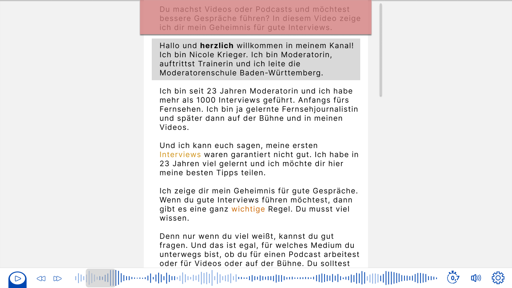

=== ...Markierung auch in Audioleiste?

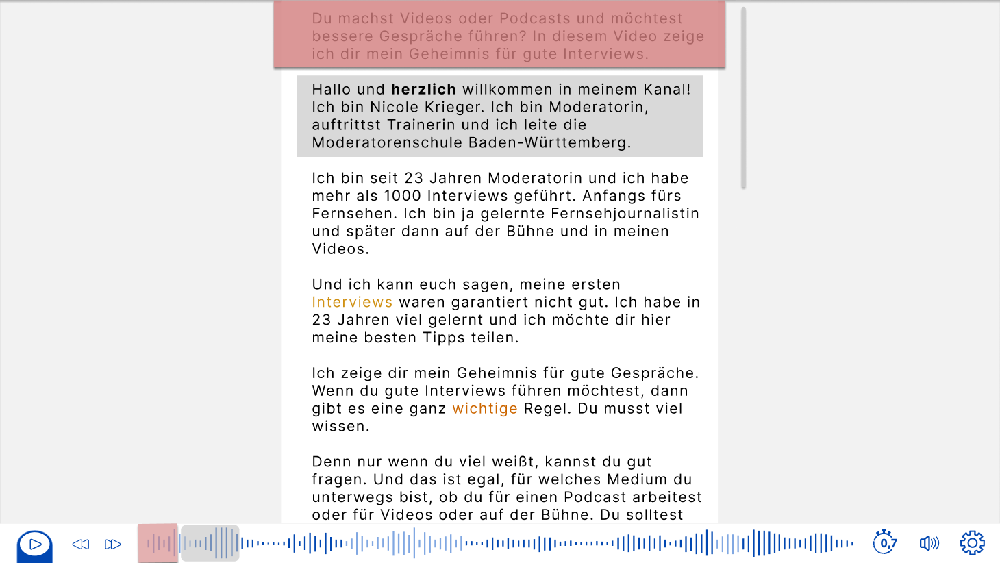

== Anfang der Bearbeitungszeit

* Zusätzliche Frage: In diesem Fall keine graue Textbox. Sollte diese ab der ersten Markierung immer vorhanden sein oder kann man sie auch wegklicken, z.B. durch klick auf Bereich außerhalb des Textblatts?

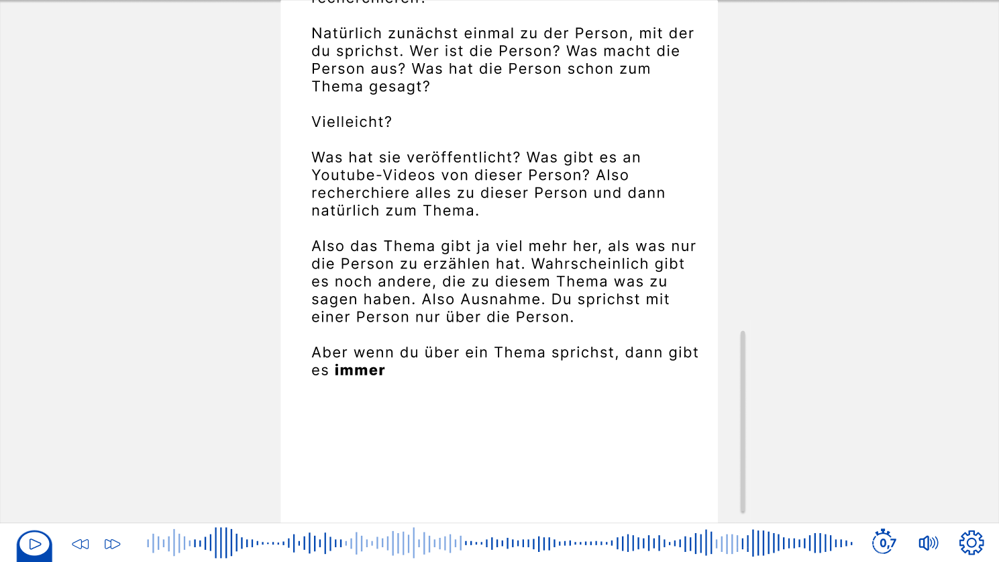

== Button-on-Press

=== Geschwindigkeitsregler

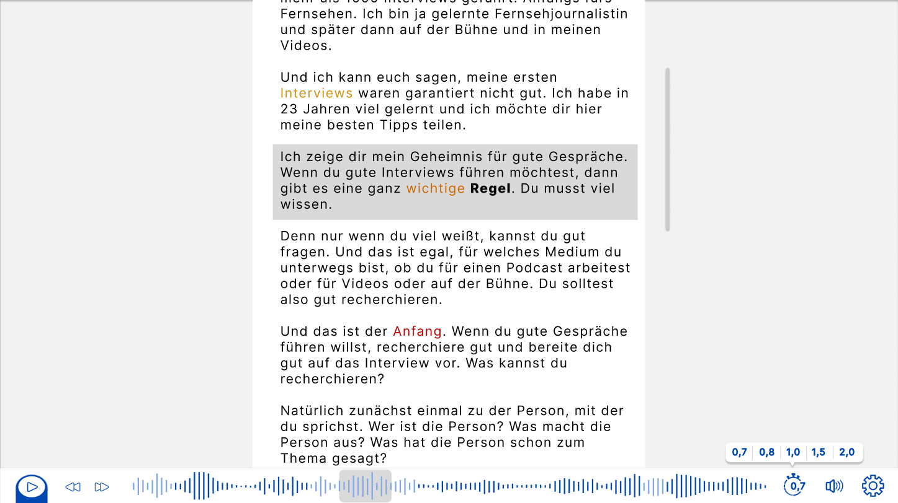

=== Lautstärkeregler

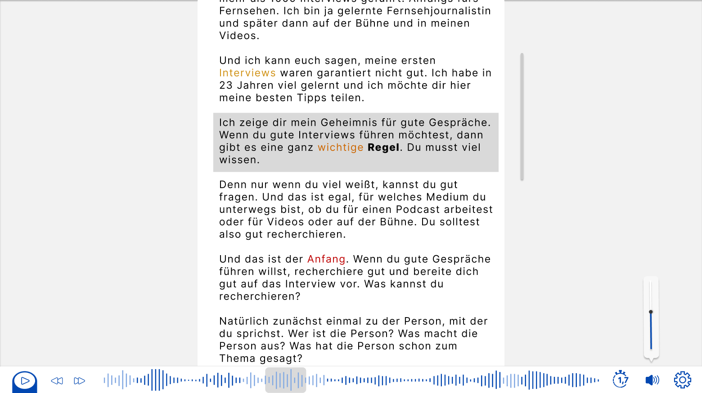

=== Pause + Zurückspringen on-click

==== Alternative 1 

* Idee: Animationsübergang zwischen Play- und Pause-Symbol, siehe z.B. Youtube

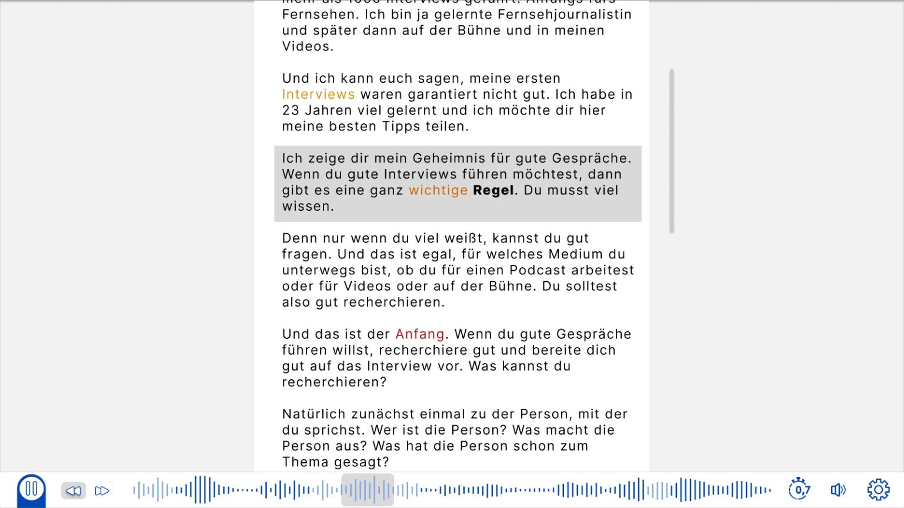

==== Alternative 2

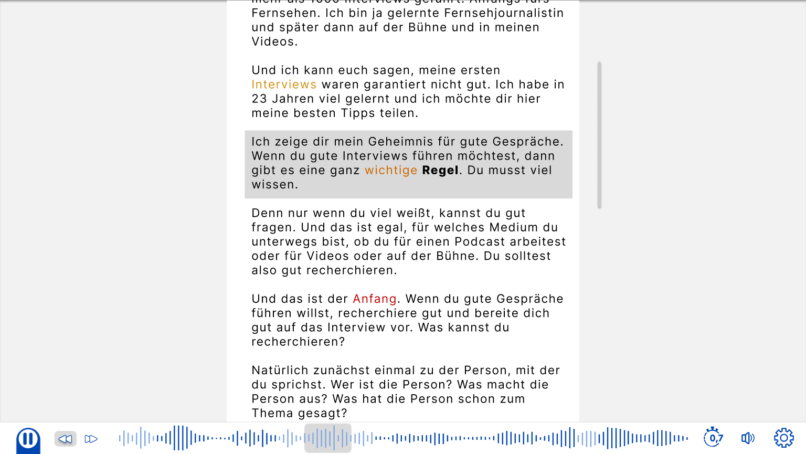

==== Alternative 3

* anderer Schatten (nur teamrelevant)

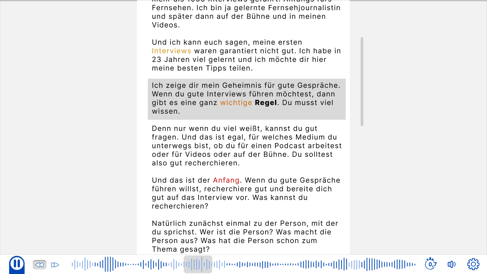

== Beispiel für Text, der in zwei Minuten gesprochen wird

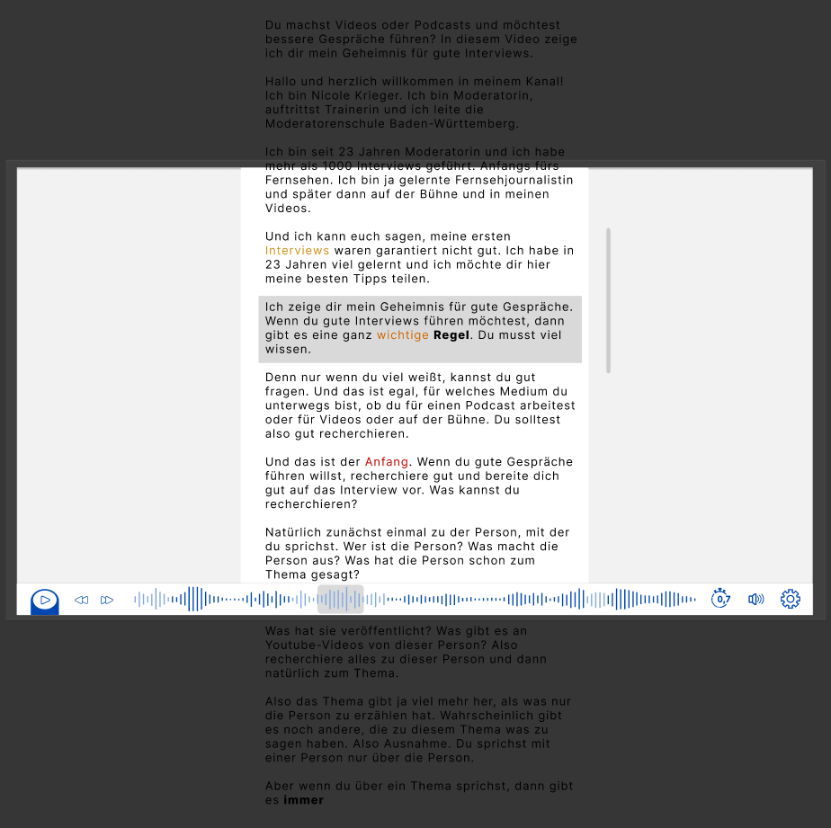

== Alternative Ideen

=== Markierung aktuelles Wort in Audioleiste

* aktuell gesprochenes Wort wird durch grauen Strich in Audioleiste repräsentiert
* Zusätzliche Frage: Kann dieser mit der Maus gezogen werden?

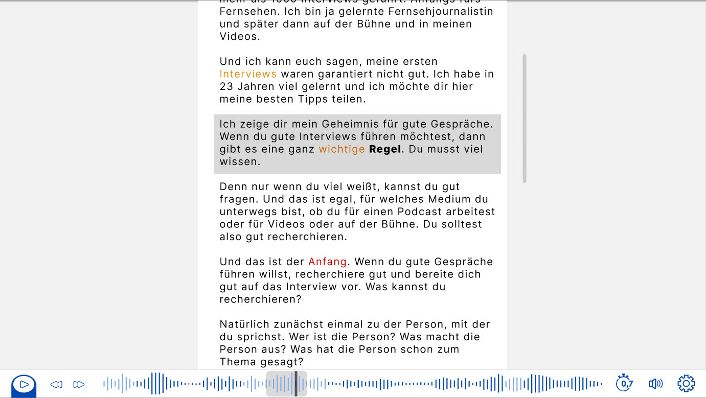

=== Alternative zur Confidence-Level Markierung

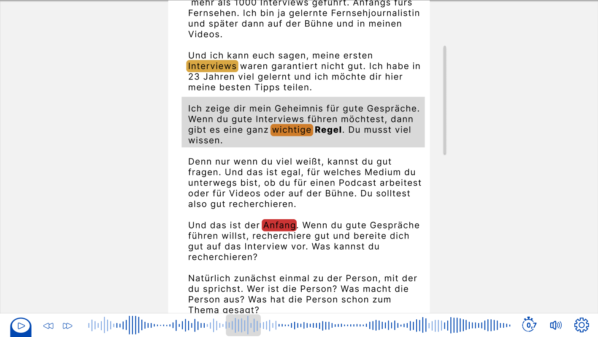

=== Scrollbar innerhalb der Audioleiste & Geschwindigkeit +/-

==== Scrollbar

* Idee: für zusätzliches Gefühl, wo der aktuelle Textausschnitt in der gesamten Audio einzuordnen ist zusätzliche Scrollbar-Kopie über Audioleiste
* diese kann auch bewegt werden und ist mit der anderen verbunden, so das ein links/rechts Scrollen da für eine Bewegung des Textausschnitts sorgt

==== Geschwindigkeit

* Wird vermutlich oft über Hotkeys verändert
* für Maus-Benutzer one-click veränderung der Geschwindigkeit statt two-click über Menüleiste

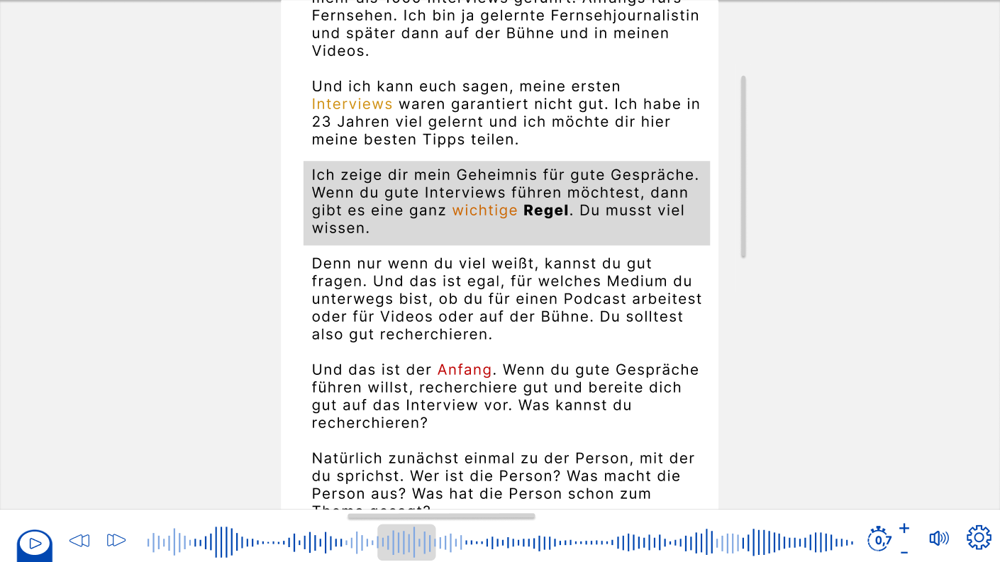

=== Farbliche Unterscheidung Sprecher (Textblatt)

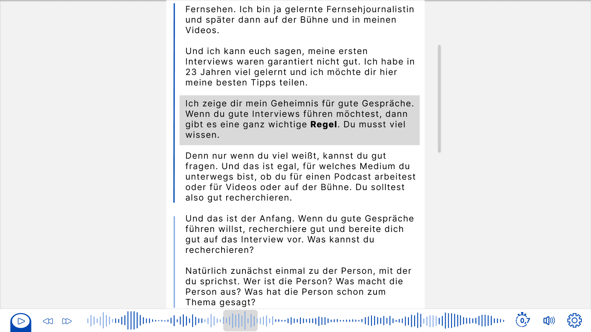

___
https://www.figma.com/file/LTqpaZIrBg6V28l1GN3tUB/Untitled?type=design&t=sEA9eVFHbdY1OZwZ-1[Link zum Figma-Board, auf dem wir alle Wireframes gemeinsam erstellt haben.^]

Kurze Anmerkung: Die vertikale Aufteilung sind relevante Features, die dargestellt werden, horizontale Frames sind mögliche Alternativen zu (bestehenden) Features.