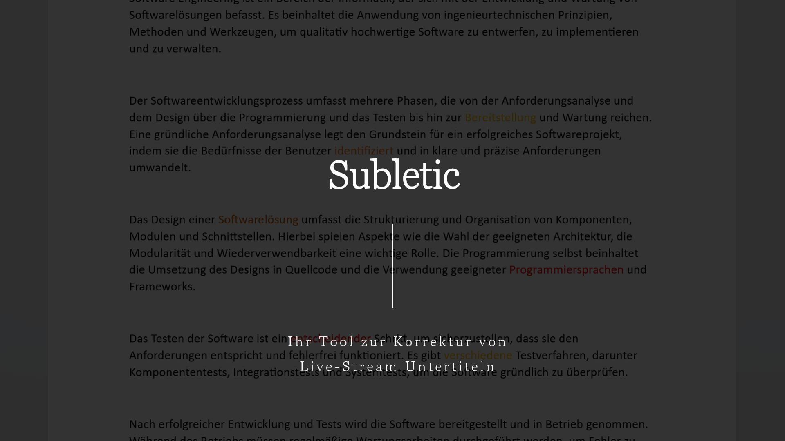

= Script für das 6 Minütige Video
:toc:

== 1. Einleitung [15s (15/360)]

=== Notes
* Projekt Thema vorstellen, dabei auch auf das Hauptziel unsere Software eingehen
* Kurz wer sind wir also unsere Namen
* Name unseres Kunden
** Grundig Business Systems oder Grundig Business Systems GmbH & Co. KG

=== Text
Guten Tag und herzlich willkommen zur Projektpräsentation von Subletic. In diesem Video möchten wir Ihnen unsere Software vorstellen, mit der die korrekte Untertitelung von Live-Streams zu einem Kinderspiel wird. Kommen Sie mit und lernen Sie unseren innovative Software-Lösung kennen.

Tauchen Sie mit uns ein und entdecken Sie, wie Subletic das Korrigieren von Live-Untertiteln vereinfacht und optimiert.

=== Visual
1. Startfolie (10s)
1.1 Namen, etc.

== 2. Problemstellung [60s (75/360)]

=== Notes
* nochmal zeigen was unser Kunde als Problem ausgeschrieben hat, hierbei bin ich mir nicht 100%ig sicher ob wir das brauchen
* könnte dann allgemeiner sein ("eine Software wie diese gibt es nicht?")
** hierbei vielleicht noch auf Anwendungsbereiche eingehen: Landtag usw. (macht einen sehr Professionellen eindruck ^^)
* Anforderungen des Kunden:
** DSGVO-Konform
** Mitdenken von Anforderungen von Stenografen

=== Text

Alice ist Stenografin für einen Landtag. Sie ist seit einigen Jahren in Ihrem Beruf schon tätig. Seit kurzem hat sie von den großen Fortschritten in der Sprachsynthese gehört und fragt sich ob auch sie davon profitieren kann. Jedoch weiß sie als Stenografin, wie wichtig korrekte Transkriptionen sind in politischen Kontexten und stellt sich deshalb die Frage: "_Kann ich der KI denn blind vertrauen?_". 

Nein, in vielen Kontexten braucht es den Menschen, der der Maschine auf die Finger guckt. Und genau dabei möchte unsere Software _Subletic_, Alice unterstützen. So hat Sie durch die automatische Sprachsynthese weniger Zeitdruck wie bei der Stenografie, kann aber gleichzeitig sicher sein, dass die Transkription korrekt ist. 

Gleichzeitig profitieren die Zuschauer zuhause von besseren Untertiteln und müssen sich nicht mit meist schlechten generierten Untertitel zufrieden geben. Und damit die Software auch tatsächlich von Alice in Ihrem Landtag verwendet werden darf, ist sie oben drauf noch DSGVO-konform.

* Crazy Animation von Alice, das alte Haus 💁‍♀️

== 3. Lösung/Funktionalität [60s (135/360)]

=== Notes
* eingehen auf die Bestehende Funktionalität was haben wir bisher
** Wie eine Art "Demo" hauptfunktionalitäten der Software hervorheben
* wie funktioniert unsere Software für den Endnutzer

=== Text
Was macht also unsere Software _Subletic_?

1. Zunächst wird ein beliebiger Live-Stream eingelesen, zum Beispiel von einer Landtagsdebatte, wie bei Alice.
2. Nun erscheinen auf der Benutzeroberfläche nach und nach die erzeugte Transkriptionen, in sogenannten Sprechblasen. In einem festgesetzten Zeitfenster von einer Minute, können nun die fehlerhaften Wörter korrigiert werden.
3. Dabei unterstützt die Software bei der Identifikation von falsch erkannten Wörtern, indem die Wörter, bei denen die Speech-Engine sich unsicher ist, farbig markiert werden. 
4. Ein weiteres Hilfsmittel, welches Alice schon aus der Stenografie bekannt ist, ist ein Playback des Gesagten, in der vor und zurück gesprungen werden kann. _[break]_ Sie kann sich so vergewissern, ob die Transkription korrekt ist.
5. Fällt eine Sprechblase aus dem Zeitfenster heraus, verschwindet sie von der Benutzeroberfläche und ist damit bereit für die Auslieferung an die Zuschauer.

Wir sehen dass _Subletic_ ein hilfreiches Werkzeug ist, welches Alice's Arbeit wesentlich vereinfacht.

// Homeoffice als Stenografin ist mittels unserer Software kinderleicht. [Zoom auf Monitor mit unserer Software, übergang zur richtigen Software] (Bei switch ins Programm, läuft dann im Hintergrund läuft dann der Ton der Audio) Wie Sie sehen [Lautstärken Anpassung] läuft der Text ohne größere Mühen über den Monitor. Hierbei ist es für Anwender einfach [Korrektur von einem Gelben/Rotem Wort] direkt in Fehlerhaft Übersetzungen einzugreifen und somit Zuschauern ein vernünftigen Untertitel zu liefern. *Denn was ist blöder als Taub zu sein, schließlich schlecht Untertitel*

=== Visual

Video von unserer Software die die genannten Features visualisieren

[options="header"]
|===
| Section | Topic | Visualisation
| 1. | Stream-einlesen | Animation
| 2. | Sprechblasen | Ankommenden Sprechblase zeigen
| 3. | Confidence-Werte | Umrandung der farbigen Wörter
| 4. | Audio-Spur | In der _[break]_ Audio-Schnippsel abspielen
| 5. | Zeitfenster | Verschwindene Sprechblase zeigen
|===

== 4. Technologien [60 (195/360)]
* Wie sieht eine Softwarelösung aus?
* hervorheben der Wichtigsten Funktionen, welche vlt. auch von Philipp ausgerufen wurden
* hier erklären wir welche Tools und Libraries sich als hilfreich herausgestellt haben
** FFMpegCore
** SignalR
** Web-Audio-API
* Hier können wir auch auf die Vorteile unserer Software eingehen

=== Text

Nun möchten wir auf die Technologien eingehen die wir verwendet haben.
Für Subletic haben wir auf ASP.NET 7 im Backend gesetzt, in dem die interne Verwaltung stattfindet. Dazu zählt:

* der reinkommenden Stream
* die Kommunikation mit der Speech-Engine
* die Sprechblasen
* sowie der Export der korrigierten Untertitel

Zudem nutzen wir FFMpegCore, um mit den verschiedenen Video- und Audio-Streams umgehen zu können.

Angular 16 ist das Gerüst für unser Frontend. SignalR gibt uns dabei die Fähigkeit unsere Sprechblasen, sowie die Audio, in unser Frontend zu streamen. Die Web-Audio-API befähigt uns anschließend mit der Audio-Spur umzugehen, um Features wie das Navigieren in der Audio oder eine anpassbare Lautstärke, bereitzustellen. 

Beide Seiten unserer Software werden zunächst getrennt in einem eigenen Docker-Image bereitgestellt und anschließend mit einer Docker-Compose zusammengeführt und deployed. |Dies hat den Hintergrund das wir somit im Development eine klarere Trennung von Frontend und Backend einführen konnten.|

== 5. Architektur [120s (315s/360)]

=== Text
Gehen wir nun ins Detail und betrachten die Architektur und internen Abläufe, welche im Hintergrund stattfinden. Es sind drei relevante Bereiche zu sehen:

* Das Frontend welches mit Angular gebaut wurde,
* das Backenend welches unter ASP.NET läuft,
* und die Außenwelt, mit APIs, Quell- und Ziel-Streams

Betrachten wir zunächst das Backend. Bevor ein Untertitel generiert werden kann, wird ein Audio-Stream benötigt, für den eine Untertitel erstellt werden soll. Dieser wird mithilfe von FFMpegCore innerhalb des AV-Processing Services eingelesen und in 1 sekündige Pakete unterteilt. 

Die Audio-Pakete werden dann, nach und nach, an eine externe Speech-Engine geschickt, welche darauffolgend mit der generierten Transkription antwortet. (Zusätzlich trägt die Antwort auch die Information, mit welcher Sicherheit ein Wort erkannt wurde.) Gleichzeitig wird die Audiospur direkt ins Frontend gestreamt, sodass diese gehört werden kann.

Die erhaltenen Transkriptionen werden nun mithilfe des Word-Processing-Services in sogenannte _Speechbubbles_ umgewandelt. Sie stellen eine kleine Folge von Wörtern da und werden vom Speechbubble-Service verwaltet. 

Um sicherzustellen, dass die eingelesenen Transkriptionen und der angekommene Audio-Stream schließlich das Backend verlassen und dem Endkunden ausgespielt werden, kommt der Buffer-Time-Monitor zum Einsatz. Er überwacht den internen Zustand der Sprechblasen, sowie der Audio und stößt alle notwendigen Lösch- und Export-Prozesse an, sobald Daten aus einem festgelegten Zeitfenster fallen.

Für die Kommunikation mit dem Frontend, verwenden wir den Speechbubble-Controller. Dieser stellt alle notwendigen Schnittstellen zur Verfügung, um neue Speechbubbles anzuzeigen, zu löschen oder korrigierte Speechbubbles entgegenzunehmen.

Das Frontend nimmt die vom Speechbubble-Controller gesendeten SignalR-Streams mit den Sprechblasen an und speichert diese in der Speechbubble-Chain. Sie stellt die Frontend-seitige Datenstruktur da, welche die Speechbubbles in einer Liste vorhält. Diese kann dann dazu genutzt werden, die jeweiligen Speechbubbles in Textboxen zu visualisieren. Werden vom Anwender einige Wörter verändert, löst dies einen Update-Call aus, welcher die geänderte Speechbubble an das Backend schickt. 

(Parallel dazu werden die reinkommenden Audio-Pakete in einem Ring-Buffer abgelegt und verwaltet. So kann das Frontend den Buffer jederzeit verwenden, um die Audiospur auszulesen und zu manipulieren.)

== 6. Ausblick [60s (375/360)]
=== Notes
* Hier würde ich sagen gehen wir darauf ein wie wir unsere Software weiter verbessern, weiterentwickeln
** Hardware Komponenten vielleicht sogar an dem Tag mit bringen zum zeigen?
*** Vielleicht sogar hierfür Bilder verwenden von den Geräten selbst

=== Text

Wir haben gesehen wie mit _Subletic_ schon jetzt fehlerhaft generierte Untertitel mühelos korrigiert werden können. In einem nächsten Schritt, wollen wir uns der Auslieferung an den Endkunden widmen. Eine entscheidende Fragestellung ist dabei, wie wir die generierten Transkriptionen so portionieren, dass gut lesbare Untertitel, auf dem Bildschirm erscheinen.

Außerdem wollen wir den Korrektur-Workflow von _Subletic_ optimieren indem wir dem Anwender weitere Hilfen anbieten, um schneller und effizienter zu Korrigieren. Dies ist vor allem in stressigen Situationen von Vorteil, wenn die Speech-Engine viele Fehler macht und daher auch viele Korrekturen notwendig sind. Perspektivisch möchten wir _Subletic_ mit Wortvorschlägen ergänzen, um kostbare Zeit einzusparen. Diese könnten entweder aus schon korrigierten oder phonetisch ähnlichen Wörtern generiert werden.
Ein weiterer Ansatzpunkt, welchen wir verfolgen möchten ist die Integration von Hand- und Fußschaltern, sodass Stenografen mit bekannten Eingabegeräten arbeiten können. 

(Grundsätzlich wollen wir die visuelle Kommunikation mit dem Nutzer verbessern, sodass sich Anwender schneller zurechtfinden und orientieren können.)

== 7. Ende [15s (390/360)]

=== Text

Wir hoffen wir konnten Sie von _Subletic_ überzeugen und freuen uns auf ihr Feedback. Sollten noch Fragen offen geblieben sein, sprechen sie uns gerne an. Wir danken allen Beteiligten, im besonderen unserem Projektsponsor, der GRUNDIG Business Systems GmbH & Co. KG.

