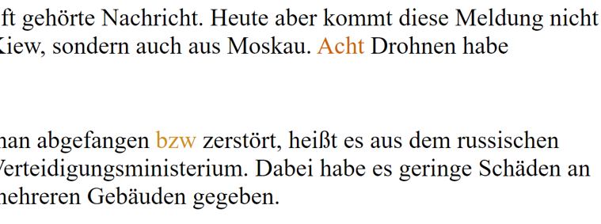
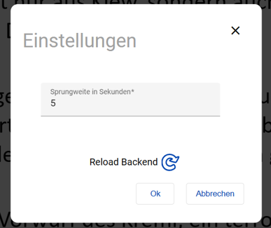
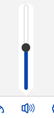
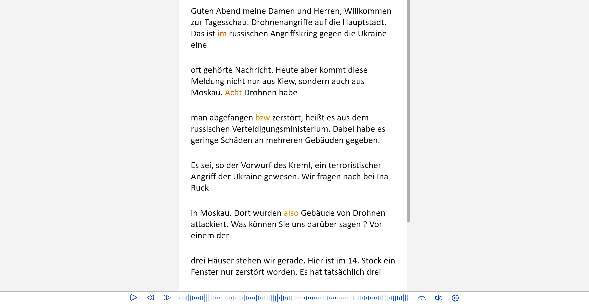

    

      
    

# Subletic

Entdecken Sie die Leistungsfähigkeit und Einfachheit von Subletic und verbessern Sie die Zugänglichkeit Ihrer Veranstaltungen - für ein Publikum, das auf Ihre Worte zählt.

## Motivation

Unsere Motivation für dieses Projekt liegt in der Notwendigkeit, einen realen Bedarf zu erfüllen und eine innovative Lösung zu entwickeln. Unser Projektsponsor, die Grundig Systems GmbH, hat erkannt, dass es einen dringenden Bedarf an einer hochmodernen Webanwendung gibt, die die Korrektur von Live-Untertiteln ermöglicht, um Personen, die auf Untertitel angewiesen sind, auch eine Maß an Stimmigkeit zu bieten. Bisher gibt es keine vergleichbare Software auf dem Markt, die diese speziellen Anforderungen erfüllt und die Barrierefreiheit berücksichtigt.

Um die Relevanz und Bedeutung dieses Projekts zu unterstreichen, möchten wir einige Beispiele und Personas nennen, die von dieser Software profitieren können. Politiker im Landtag können sicherstellen, dass ihre Reden barrierefrei und präzise für alle Zuhörer mit Untertiteln übertragen werden, die hat auch zum Vorteil, dass Namen zukünftig korrekt übersetzt werden. Auch Personen mit Hörbeeinträchtigungen oder Menschen, die in lauten Umgebungen arbeiten, profitieren von der Möglichkeit, die Live-Untertitel in Echtzeit korrigieren zu lassen. Weitere wichtige Personas sind Stenografen, diesen wird durch unsere Software eine neue Möglichkeit geboten, ihren Job auszuführen und die Qualität von Untertiteln zu erhöhen.

Mit dieser Software wollen wir einen echten Mehrwert schaffen, indem wir eine Lücke schließen und den Bedürfnissen der Menschen gerecht werden. Das Projekt ist nicht nur technisch herausfordernd, sondern hat auch eine soziale Komponente, da es Menschen dabei unterstützt, barrierefrei auf Informationen zuzugreifen und ihre Kommunikation zu verbessern. Hervorzuheben ist auch, dass diese Umsetzung zu jeder Zeit unter Berücksichtigung der DSGVO erfolgt ist.

## Ziele und Vorgehen

Im Rahmen dieses Projekts haben wir uns zusammen mit unserem Projektsponsor Philipp Platis konkrete Ziele gesetzt, um sowohl funktionale als auch nicht-funktionale Eigenschaften der Software zu realisieren.

### Dabei wurden folgende Features entwickelt:

**Hervorhebung von Wörtern mit einem niedrigen Konfidenz-Wert:**

  

    Um eine verbesserte Korrektur von Live-Untertiteln zu ermöglichen, haben wir eine Funktion implementiert, die Wörter mit geringer Konfidenz farblich markiert. Der Konfidenz-Wert gibt an, wie sicher sich die Speech Engine bei der Erkennung des jeweiligen Wortes ist.
  

  

    
  

 

**Springen in der Audio-Spur und Ausgabe des Audios in der Anwendung:**

  

    Unsere Software ermöglicht es den Nutzern, in der Audio-Spur vor- und zurückzuspringen. Zusätzlich wird das Audiosignal innerhalb der Anwendung wiedergegeben, um eine praktische und nahtlose Arbeitsumgebung zu gewährleisten.
  

  

    
  

 

**Einstellbare Sprungweite der Audio:**

  

    Die Software ermöglicht es den Benutzern, die Sprungweite innerhalb der Audio-Spur anzupassen. Dadurch können sie schnell zu bestimmten Stellen springen, um Korrekturen vorzunehmen oder bestimmte Passagen zu überprüfen.
  

  

    
  

 

**Starten und Anhalten der Audio per Tastenkombination:**

Um die Effizienz der Nutzer zu steigern, haben wir Tastenkombinationen implementiert, um das Starten und Anhalten der Audio-Wiedergabe zu erleichtern. Dadurch können sie schnell reagieren und ihren Fokus auf die Untertitelkorrektur legen.

**Anpassbare Lautstärke und Abspielgeschwindigkeit der Audio:**

  

    Unsere Webanwendung ermöglicht es den Nutzern, die Lautstärke des Audios innerhalb der Anwendung anzupassen. Darüber hinaus können sie die Geschwindigkeit der Audio-Wiedergabe an ihre individuellen Bedürfnisse anpassen, dies wurde als eine der wichtigsten Feature beschrieben, da Stenografen meisten die Geschwindigkeit von Audio drosseln, um besser Fehler zu erkennen.
  

  

    
  

### Neben den funktionalen Eigenschaften haben wir auch Wert auf nicht-funktionale Aspekte gelegt:

**Schlichtes Design:**

  

    Das Design unserer Webanwendung ist bewusst schlicht gehalten, um eine intuitive und benutzerfreundliche Oberfläche zu bieten. Der Fokus liegt auf der einfachen Bedienbarkeit und dem klaren Layout, um eine effektive Nutzung zu ermöglichen.
  

  

    
  

 

**Corporate Design:**

  

    Um eine einheitliche Markenidentität zu schaffen, welche Anwendern dazu verhilft unsere Software wiederzuerkennen, haben wir ein Corporate Design in unsere Software integriert. Dies beinhaltet ein Logo und unseren Corporate Namen "Subletic", der unser Projekt repräsentiert.
  

  

  

    Subletic
  

  

    
  

 

Durch die Umsetzung dieser Ziele konnten wir eine leistungsstarke und benutzerfreundliche Webanwendung entwickeln, die die Korrektur von Live-Untertiteln erleichtert und gleichzeitig ästhetischen Ansprüchen gerecht wird. Dabei ist das Ausführen der Features stets intuitiv, was das Korrigieren von Untertiteln spielend leicht macht.

## Umsetzung

Das Projekt wurde als Webanwendung umgesetzt und besteht aus zwei Repositorys, eines für das Frontend mit Angular Version 16 und eines für das Backend mit ASP.NET Version 7. Um diese beiden Repositorys miteinander Kommunizieren zu lassen, werden im Deployment zwei Dockerimages erstellt. Diese Dockerimages werden dann mit einer `Docker-Compose.yml` zusammengeführt. Bei der Umsetzung lag ein besonderer Fokus auf der Einhaltung der Datenschutz-Grundverordnung (DSGVO), um die Privatsphäre und Sicherheit der Benutzer zu gewährleisten. Dies ist auch eine der vom Projektsponsor ausdrücklich wichtigsten Punkte bei der Umsetzung der Webanwendung.

Für die Implementierung wurden verschiedene Komponenten und Technologien verwendet. Im Backend wurden das Framework ASP.NET sowie die Tools FFmpeg und SignalR eingesetzt. FFmpeg ermöglicht die Verarbeitung von Audio- und Videodateien, während SignalR Echtzeitkommunikation zwischen Server und Client ermöglicht.

Ein zentraler Bestandteil der Umsetzung ist die Verwendung einer Speech-Engine, die kontinuierlich Audiostreams transkribiert. Dadurch wird eine Echtzeit-Untertitelung ermöglicht, die nahtlos mit der Audioquelle synchronisiert ist. Dieser Stream wird dann wie im unterpunkt _Schlichtes Design_ zu sehen im Frontend Visualisiert. Die Funktionsweise der Speech-Engine sieht wie folgt aus, unser Stream wird 

## Projektsponsor und Team

    

  

    
    

      Philipp Platis
    

  

  

    <table>
  <tr>
    <th>Das Team</th>
    <th></th>
  </tr>
  <tr>
    <td>Benedikt Beigang</td>
    <td>Luca Noack</td>
  </tr>
  <tr>
    <td>Finn Romeis</td>
    <td>Luca Franke</td>
  </tr>
  <tr>
    <td>Chantal Bley</td>
    <td>Christoph Neidahl</td>
  </tr>
  <tr>
    <td>Pascal Dittes</td>
    <td>Amine Jegani</td>
  </tr>
</table>
  

