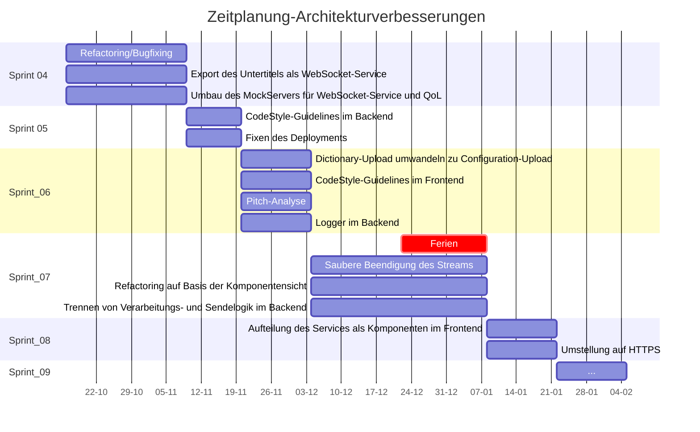

```mermaid
gantt
    title Zeitplanung-Architekturverbesserungen
    dateFormat  DD-MM-YYYY
    axisFormat %d-%m
                
    section Sprint 04
    Refactoring/Bugfixing                                 : 16-10-2023, 09-11-2023
    Export des Untertitels als WebSocket-Service          : 16-10-2023, 09-11-2023
    Umbau des MockServers für WebSocket-Service und QoL   : 16-10-2023, 09-11-2023

    section Sprint 05
    CodeStyle-Guidelines im Backend                       : 09-11-2023, 20-11-2023
    Fixen des Deployments                                 : 09-11-2023, 20-11-2023

    section Sprint_06
    Dictionary-Upload umwandeln zu Configuration-Upload   : 20-11-2023, 04-12-2023
    CodeStyle-Guidelines im Frontend                      : 20-11-2023, 04-12-2023
    Pitch-Analyse                                         : 20-11-2023, 04-12-2023
    Logger im Backend                                     : 20-11-2023, 04-12-2023

    section Sprint_07
    Ferien                                                : crit, 22-12-2023, 08-01-2024
    Saubere Beendigung des Streams                        : 04-12-2023, 08-01-2024
    Refactoring auf Basis der Komponentensicht            : 04-12-2023, 08-01-2024
    Trennen von Verarbeitungs- und Sendelogik im Backend  : 04-12-2023, 08-01-2024

    section Sprint_08
    Aufteilung des Services als Komponenten im Frontend   : 08-01-2024, 22-01-2024
    Umstellung auf HTTPS                                  : 08-01-2024, 22-01-2024

    section Sprint_09
    ...                                                   : 22-01-2024, 05-02-2024
```