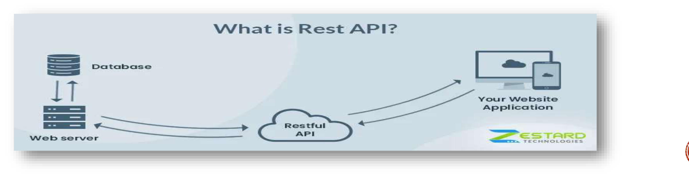

*__TECHNICAL RESEARCH – C#, ASP.NET, RESTFull APIS AND HTTP-Protokoll*

*Contents:*

**  Was ist C#?

** Was ist Angular?

** Was ist ASP.NET?

** Was ist das HTTP-Protokoll?

** Was ist Rest-ful APIs?

** Wie werden C#, ASP.NET, Angular und das HTTP- Protokoll zusammen verwendet?

** Vorteile der Verwendung von C#, ASP.NET, Angular und dem
HTTP-Protokoll zusammen.

** diese Technologien in unserem Projekt.

** Zusammenfassung.

*__Was ist C#?*
****
• Eine Programmiersprache, die von Microsoft entwickelt

• Verwendet für die Entwicklung von Windows-Anwendungen, Webanwendungen,
mobilen Anwendungen und Spielen.

• Verwendet die .NET-Plattform, um Anwendungen zu erstellen.
****

*__Was ist Angular?*

****
• Ein JavaScript-Framework, das von Google entwickelt wurde• Verwendet
für die Entwicklung von Webanwendungen, insbesondere
Single-Page-Anwendungen (SPA) +
• Verwendet eine komponentenbasierte Architektur zur +
Organisation des Codes
****

*Was ist ASP.NET?*

****
• Eine Webanwendungs-Entwicklungsplattform, die von Microsoft entwickelt

• Verwendet C# als primäre Sprache für die Anwendungsentwicklung

• Bietet verschiedene Funktionen wie Sicherheit, Authentifizierung und
Datenbankintegration

• ASP.NET ist eine leistungsfähige Plattform für die +
Entwicklung von Webanwendungen und bietet viele +
Funktionen und Bibliotheken, die die Entwicklung erleichtern,
einschließlich Datenbankanbindung, Sicherheitsfunktionen und
Benutzerauthentifizierung. Es unterstützt auch die +
Entwicklung von Webanwendungen mit einer +
komponentenbasierten Architektur, ähnlich wie bei Angular.

• Open-Source- Framework

• kann auf Windows, Linux und macOS ausgeführt werden

• Das Framework ist auch in der Lage, mit verschiedenen 
Datenbanken und Webservern zu arbeiten, einschließlich Microsoft SQL Server, MySQL, und Oracle.

****

*__Was ist HTTP-Protokoll?*

****

• Ein Protokoll, das verwendet wird, um Daten zwischen Webservern und
Clients (z.B. Browsern) zu
übertragenimage:vertopal_54a4d2fca48c4d1dbaeff9862a24a7f5/media/image11.png[image,width=888,height=217]
• Verwendet die Request-Response-Architektur, bei der der Client eine
Anfrage an den Server sendet und der Server eine Antwort zurücksendet

• Verwendet HTTP-Methoden wie GET, POST, PUT und DELETE, um verschiedene
Aktionen auszuführen

****
*__Was ist Rest-ful APIs?*

****
• RESTful APIs verwenden HTTP-Anforderungen, um Operationen an
Ressourcen durchzuführen, wie das Erstellen, Abrufen, Aktualisieren und
Löschen von Daten. Diese Operationen werden in der Regel mit
HTTP-Methoden wie GET, POST, PUT und DELETE durchgeführt.

• RESTful APIs verwenden eine einheitliche Schnittstelle, was bedeutet,
dass Ressourcen und Operationen mithilfe eines konsistenten Satzes von
URIs und HTTP-Methoden identifiziert werden.

****

*__Wie werden C#, ASP.NET, Angular und das HTTP- Protokoll zusammen verwendet?*

****

• Wenn diese drei Technologien zusammen verwendet werden, kann ein Entwickler eine vollständige Webanwendung erstellen. C# und ASP.NET können verwendet werden, um das Backend der Anwendung zu erstellen, einschließlich Datenzugriff, Geschäftslogik und Web-APIs. Angular kann
dann verwendet werden, um das Frontend der Anwendung zu erstellen, einschließlich der Benutzeroberfläche und der Interaktion mit demBackend über RESTful APIs.

• C# und ASP.NET werden verwendet, um RESTful APIs zu erstellen, die vom
Angular- Frontend aufgerufen werden können, um Daten und Ressourcen abzurufen und zu manipulieren.

• Angular verwendet das HTTP-Modul, um HTTP-Anfragen an den Server zu senden und die HTTP-Antworten zu empfangen

• Das HTTP-Modul bietet verschiedene Methoden wie get(), post(), put()
und delete(), die mit den entsprechenden HTTP-Methoden übereinstimmen

• Die HTTP-Anfragen und -Antworten verwenden JSON (JavaScript Object Notation) als Datenformat
****

*__Vorteile der Verwendung von C#, ASP.NET, Angular und dem HTTP-Protokoll zusammen.*

****
• C#, ASP.NET und Angular bieten eine starke Integration, um
Webanwendungen schnell und effizient zu entwickeln

• Das HTTP-Protokoll ermöglicht eine schnelle und zuverlässige
Übertragung von Daten und Ressourcen zwischen dem Server und dem Client

• Die Verwendung von JSON als Datenformat ermöglicht eine einfache
Handhabung von Daten zwischen C#, ASP.NET und Angular

• ASP.NET bietet viele Funktionen und Tools, um die Entwicklung von
Webanwendungen zu vereinfachen, wie z.B. Routing, Sicherheit,
Authentifizierung und Datenbankintegration
****

*__diese Technologien in unserem Projekt*

****
• C# und ASP.NET können verwendet werden, um das Backend der Anwendung
zu erstellen, einschließlich der Verarbeitung der Audioeingabe, der
Spracherkennung und der Übertragung der Daten in Echtzeit. Das Backend
kann auch die Datenspeicherung und den Datenzugriff verwalten.

• Angular kann verwendet werden, um das Frontend der Anwendung zu
erstellen, einschließlich der Benutzeroberfläche und der Interaktion mit
dem Backend über RESTful APIs. Angular bietet eine Vielzahl von
Funktionen, wie z.B. Routing, Komponenten, Vorlagen, Forms und mehr, um eine ansprechende und benutzerfreundliche Benutzeroberfläche zu erstellen.

• Zusammen können diese Technologien eine leistungsstarke und
skalierbare Anwendung bereitstellen, die auf einer robusten Architektur
aufbaut. Die Bearbeitungsfunktionen können in das Frontend integriert
werden, um die Benutzererfahrung zu verbessern und die Bearbeitungszeit
zu verkürzen.
****
*__Zusammenfassung:*

****

• C#, ASP.NET, Angular und das HTTP-Protokoll werden oft zusammen
verwendet, um Webanwendungen zu entwickeln.

• C# und ASP.NET werden verwendet, um RESTful APIs zu erstellen, die vom
Angular-Frontend aufgerufen werden können, um Daten und Ressourcen
abzurufen und zu manipulieren.

• Angular verwendet das HTTP-Modul, um HTTP-Anfragen an den Server zu
senden und die HTTP-Antworten zu empfang
****
