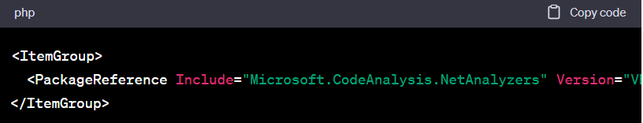

= Statische Quellcode-Analyse

== Was genau ist das?
* Methode zur Überprüfung von Codequalität und Identifizierung von Fehlern und potenziellen Schwachstellen im Code
* Analyse auf Basis des Quellcodes selbst (wird also nicht ausgeführt, Unterschied zu dynamischen Tests)
* => garantiert Best Practices und gibt frühes Feedback, um konstant Codequalität zu gewährleisten

== Wichtige Qualitätsmerkmale
* **Analysequalität**: Identifizierung von Codierungsfehler, Leistungsprobleme, Sicherheitsrisiken und stilistische Fehlern
* **Integration**: Lässt es sich einfach in die CI/CD-Umgebung einbauen?
* **Programmiersprachen** 
* **Benutzerfreundlichkeit**: Ist die Software einsteigerfreundlich?
* **Geschwindigkeit**
* **Kostenlos**

== Vergleich gängiger Anwendungen
|===
| Tool | Analysequalität | Integration in CI/CD | Programmiersprachen | Einsteiger*freundlichkeit | Geschwindigkeit | Kostenlos

| SonarQube | Sehr gut | Sehr gut | Mehrere | Gut | Mittel | Ja (Community-Version)
| PMD | Gut | Gut | Mehrere | Sehr gut | Schnell | Ja (Open-Source)
| Roslyn Analyzers | Sehr gut | Sehr gut | C# | Sehr gut | Mittel | Ja (Open-Source)
| StyleCop | Gut | Mäßig | C# | Sehr gut | Schnell | Ja (Open-Source)
| TSLint | Gut | Mäßig | TypeScript | Sehr gut | Schnell | Ja (Open-Source)
| ReSharper | Sehr gut | Gut | C#, VB.NET | Weniger gut | Mittel | Nein (kommerziell)
| NDepend | Sehr gut | Gut | Mehrere | Weniger gut | Langsam | Nein (kommerziell)
|===

== Details zu einzelnen Tools
=== Roslyn Analyzers
* Von Microsoft entwickeltes Tool
* Integration in CI/CD: Das Tool kann als NuGet-Paket heruntergeladen werden und kann in den Build-Prozess eingebunden werden. Darüber hinaus kann es über den Visual Studio Marketplace heruntergeladen und in *Visual Studio* integriert werden => hohen Integrationsfähigkeit, aber Plattformeingeschränkt (gibt auch Plugin für *VSCode* anscheinend)
* Roslyn Analyzers ist speziell für die statische Analyse von *C#-Code* entwickelt worden. Es ist jedoch auch möglich, das Tool für *Visual Basic .NET (VB.NET)* zu verwenden.

=== SonarQube
* (hohe Analysequalität)
* bietet Plug-ins und Erweiterungen für viele gängige Entwicklungsumgebungen und Build-Tools wie *Jenkins, GitLab, Maven und Visual Studio*. Die Integration ermöglicht eine automatische Analyse des Quellcodes bei jedem Build und liefert sofort Feedback an das Entwicklerteam
* (VSCode: Erweiterung SonarLint)
* SonarQube unterstützt eine Vielzahl von Programmiersprachen wie *Java, C#, JavaScript, TypeScript, Python* und viele mehr
* gibt kostenlose Community Edition, allerdings auch kostenpflichtige Version mit zusätzlichen Funktionen

=== PMD
*  Plug-Ins für *Jenkins, Maven, Gradle, Ant, VSCode und Eclipse*
* sowohl über die Kommandozeile als auch über eine grafische Benutzeroberfläche benutzbar

=== Wie funktionieren Reports in CI/CD?
* Bei Roslyn Analyzers und PMD werden in der CI/CD Pipeline Reports erzeugt, die auf Probleme im Code hinweisen. Diese Reports können dann vom Entwickler oder vom CI/CD-System ausgewertet werden, um die genauen Probleme zu identifizieren und entsprechende Maßnahmen zu ergreifen. In der Regel werden die Reports in einem speziellen Format wie XML oder HTML generiert, das leicht automatisch ausgewertet werden kann

== Einbindungsalgorithmus am Beispiel Roslyn Analyzers
=== _Provisorisch via ChatGPT_
=== 1. *Roslyn Analyzers-Paket hinzufügen*
* Roslyn Analyzers können über das NuGet-Paket Microsoft.CodeAnalysis.NetAnalyzers in das Projekt eingebunden werden. Fügen Sie das Paket zu Ihrem Projekt hinzu, indem Sie es mit dem NuGet-Paket-Manager in Visual Studio installieren oder indem Sie der csproj-Datei des Projekts das folgende XML-Element hinzufügen:

 
_Quelltext unten in Textform_

=== 2. *Stellen Sie sicher, dass das Projekt die neueste Version von MSBuild verwendet*
* Roslyn Analyzers benötigen mindestens MSBuild Version 16.0, um in der Build-Pipeline ausgeführt zu werden. Stellen Sie sicher, dass Sie die neueste Version von MSBuild auf dem Build-Agent installiert haben, auf dem Ihre GitLab CI/CD-Pipeline ausgeführt wird.

=== 3. *Erstellen Sie ein Analyse-Target in Ihrer GitLab CI/CD Pipeline*
* Erstellen Sie in der .gitlab-ci.yml-Datei Ihres Projekts ein neues Target, das die Roslyn-Analyse ausführt. Hier ist ein Beispiel:

image::Bild2.png[]
_Quelltext unten in Textform_

* Dieses Target installiert Roslyn Analyzers, baut das Projekt und führt die Analyse aus. Die Analyseergebnisse werden in einer Datei namens roslyn-analyzers-report.txt gespeichert, die als Pipeline-Artefakt archiviert wird.

=== 4. *Konfigurieren Sie das Regelsatz-File*
* Roslyn Analyzers verwenden Regelsatz-Dateien, um zu steuern, welche Analysen ausgeführt werden sollen. Eine Beispiel-Regelsatz-Datei kann im Roslyn-Analyzers-Paket gefunden werden. Fügen Sie die Datei NetAnalyzers.ruleset dem Projekt hinzu und passen Sie sie an Ihre Bedürfnisse an.

=== 5. *Überprüfen Sie die Analyseergebnisse*
* Sobald Ihre Pipeline ausgeführt wurde, können Sie das Pipeline-Artefakt `roslyn-analyzers-report.txt` öffnen, um die Ergebnisse der Analyse zu überprüfen. Die Ergebnisse können auch in die GitLab-Oberfläche integriert werden, indem Sie ein Widget hinzufügen, das das Artefakt anzeigt
  ** Klicken Sie auf "Edit" in der oberen rechten Ecke des GitLab-Projekts
  ** Klicken Sie auf "Add Widget" in der linken Seitenleiste
  ** Wählen Sie "Pipeline Artifacts" als Widget-Typ
  ** Wählen Sie das roslyn-analyzers-report.txt-Artefakt aus der Liste aus und klicken Sie auf "Add widget"
Das Widget wird nun auf der Projekt-Startseite angezeigt und zeigt die Ergebnisse der letzten Pipeline an.

==== Anmerkung
* Hier wäre es als nächstes spannend zu sehen, wie so eine Datei aussieht und welche Informationen sie beinhaltet (roslyn-analyzers-report.txt)
* generell wäre es gut, hier anzusetzen und einmal konkret ein sQA-Tool in unsere Testpipeline einzufügen
* offene Frage: wie werden die Dateien gespeichert für unterschiedliche Contributions? Kann ja nicht immer die gleiche Datei überschrieben werden

== Zusätze
_Fragen, die während der Bearbeitung aufgekommen sind und die ich dokumentieren wollte, die aber nicht explizit relevant sind für die Aufgabenstellung._

=== Was ist ein NuGet-Paket?
* Art von Softwarepaketierung, die von Microsoft entwickelt wurde und hauptsächlich mit der Entwicklung von .NET-Software in Verbindung gebracht wird
* enthält eine DLL- oder .NET-Assembly-Datei sowie zusätzliche Ressourcen wie Konfigurationsdateien, Bilder oder andere Assets. Es kann von anderen .NET-Projekten als Abhängigkeit referenziert werden, um Code-Reuse und Komponenten-Wiederverwendung zu ermöglichen

=== Warum sind StyleCop und TSLint weniger geeignet für CI/CD?
* standalone-Tools, weniger für diesen Zweck gedacht
* möglich, sie in die Pipeline zu integrieren, jedoch erfordert es mehr Aufwand und Konfiguration im Vergleich zu Tools wie SonarQube, PMD und Roslyn Analyzers
* Art des Feedbacks, das sie in der Pipeline geben können, ist in der Regel begrenzter als bei den anderen genannten Tools

=== ASP.NET und VB.NET?
* VB.NET ist Programmiersprache und Teil der.NET Plattform
* ASP.NET ist Web-Entwicklungsplattform

=== ASP.NET + RA, SQ oder PMD?
* Ja, es ist möglich, Roslyn Analyzers, SonarQube oder PMD in eine ASP.NET-Anwendung zu integrieren, um eine statische Codeanalyse durchzuführen
* ASP.NET-Anwendungen in .NET-Sprachen wie C# oder VB.NET geschrieben werden und diese Tools für .NET-Sprachen geeignet sind

== Code, der oben nur als Bild eingefügt war: 
1. <ItemGroup>
  <PackageReference Include="Microsoft.CodeAnalysis.NetAnalyzers" Version="VERSION_NUMMER" />
</ItemGroup>

2. dotnet_build:
  script:
    - dotnet build
    - dotnet tool install --global dotnet-format
    - dotnet format --check
    - dotnet msbuild /p:DebugType=portable /p:DebugSymbols=false
  artifacts:
    paths:
      - src/**/bin/Debug/**/*.*
      - src/**/obj/**/*.*
      - tests/**/bin/Debug/**/*.*
      - tests/**/obj/**/*.*

dotnet_analyze:
  script:
    - dotnet tool install --global Microsoft.CodeAnalysis.NetAnalyzers
    - dotnet build
    - dotnet analyze --verbosity detailed --rule-set-file=roslyn-analyzers.ruleset
  artifacts:
    paths:
      - src/**/bin/Debug/**/*.*
      - src/**/obj/**/*.*
      - tests/**/bin/Debug/**/*.*
      - tests/**/obj/**/*.*

