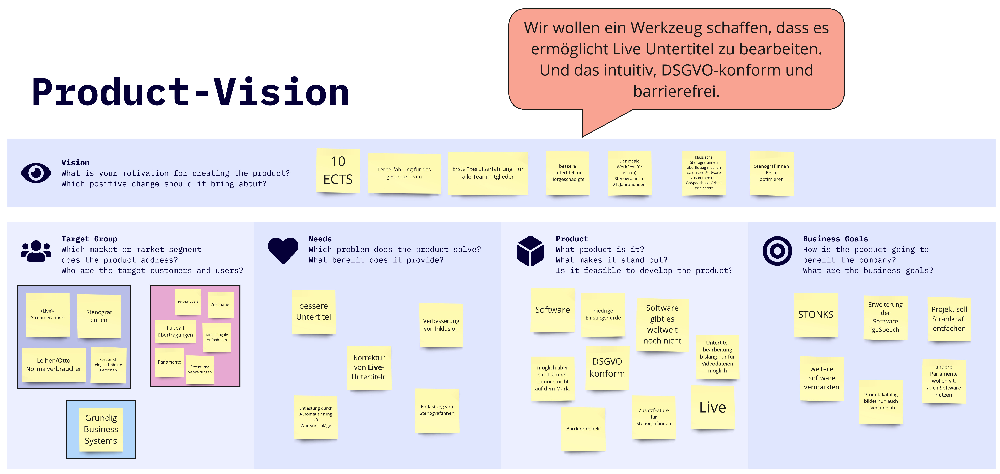
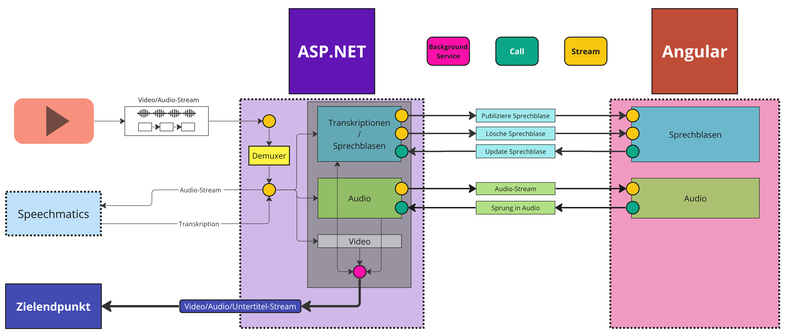

= Gruppe O - Live Stream Editor zur Korrektur von Untertiteln

* Projektleiter
** Benedikt Beigang (link:https://gitlab.dit.htwk-leipzig.de/bbeigang[@bbeigang])
** Luca Noack (link:https://gitlab.dit.htwk-leipzig.de/lnoack[@lnoack])
 
* Entwickler
** Amine Jegani (link:https://gitlab.dit.htwk-leipzig.de/ajegani[@ajegani])
** Chantal Bley (link:https://gitlab.dit.htwk-leipzig.de/cbley[@cbley])
** Christoph Neidahl (link:https://gitlab.dit.htwk-leipzig.de/cneidahl[@cneidahl])
** Finn Johann Romeis (link:https://gitlab.dit.htwk-leipzig.de/fromeis[@fromeis])
** Luca Niklas Franke (link:https://gitlab.dit.htwk-leipzig.de/lfranke2[@lfranke2])
** Pascal Fabian Dittes (link:https://gitlab.dit.htwk-leipzig.de/pdittes[@pdittes])

== Anmerkungen

* Abnahme des Piloten durch den Projektsponsor, mit Anwesenheit von Herrn Höppner.
* In den Backend- und Frontend-Repositories sind keine Tags für Sprint 1 zu finden, da zu diesem Zeitpunkt diese Repositories noch nicht existiert haben.

== Pilot

* link:https://gitlab.dit.htwk-leipzig.de/live-stream-editor-zur-korrektur-von-untertiteln/start-pilot[Lauffähiger Pilot]
* link:https://gitlab.dit.htwk-leipzig.de/groups/live-stream-editor-zur-korrektur-von-untertiteln/-/wikis/Pilotbeschreibung[Pilotbeschreibung]
* link:https://gitlab.dit.htwk-leipzig.de/live-stream-editor-zur-korrektur-von-untertiteln/frontend/container_registry/161[Docker-Dateien-Frontend]
* link:https://gitlab.dit.htwk-leipzig.de/live-stream-editor-zur-korrektur-von-untertiteln/backend/container_registry/160[Docker-Dateien-Backend]
* link:https://gitlab.dit.htwk-leipzig.de/groups/live-stream-editor-zur-korrektur-von-untertiteln/-/wikis/GitLab-Action[GitLab-Action]

== Dokumentation

* link:https://gitlab.dit.htwk-leipzig.de/groups/live-stream-editor-zur-korrektur-von-untertiteln/-/wikis/DesignThinking/ProblemDefinition[Problemdefinition]
* link:https://miro.com/app/board/uXjVMJfkJ9U=/?share_link_id=102680582842[Produktvision (Miro)]
* link:https://gitlab.dit.htwk-leipzig.de/groups/live-stream-editor-zur-korrektur-von-untertiteln/-/wikis/DesignThinking/Wireframe_1[Verwendeter Design-Thinking-Prototyp]
* link:ProjectLeadDocumentation[Projektleitdokumentation]
** link:ProjectLeadDocumentation/project_description.adoc[Projektbeschreibung]
** link:ProjectLeadDocumentation/roles_and_responsibilities.adoc[Rollen und Verantwortlichkeiten]
** link:ProjectLeadDocumentation/challenge_register.adoc[Challenge Register]
** link:ProjectLeadDocumentation/follow_up_register.adoc[Follow Up Register]
** link:ProjectLeadDocumentation/health_register.adoc[Health Register]
** link:ProjectLeadDocumentation/UserStories/Sprint_02.adoc[User Stories]
* link:IssueHistory[Exportierte Issues]

---

