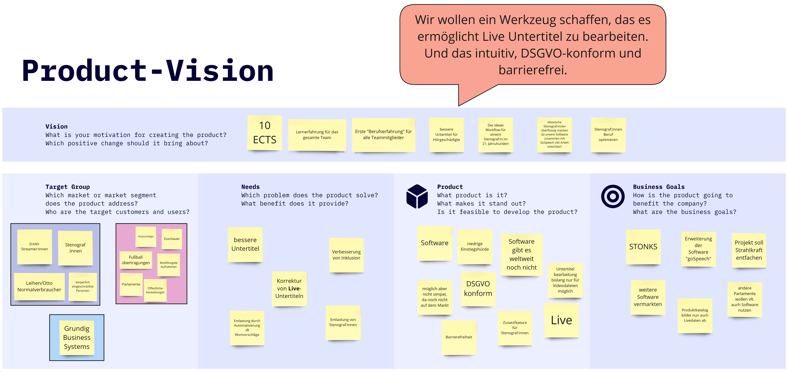

= Gruppe O - Live Stream Editor zur Korrektur von Untertiteln

[options="header", cols="^,^", style="width:100%", align="center"]
|===
2+| Projektleiter
| Benedikt Beigang
| Luca Noack
| link:https://gitlab.dit.htwk-leipzig.de/bbeigang[@bbeigang]
| link:https://gitlab.dit.htwk-leipzig.de/lnoack[@lnoack]
|===

[options="header", cols="^,^,^,^,^,^", style="width:100%"]
|===
6+| Entwickler
| Finn Johann Romeis
| Luca Niklas Franke 
| Chantal Bley 
| Christoph Neidahl 
| Amine Jegani 
| Pascal Fabian Dittes 
| link:https://gitlab.dit.htwk-leipzig.de/fromeis[@fromeis]
| link:https://gitlab.dit.htwk-leipzig.de/lfranke2[@lfranke2] 
| link:https://gitlab.dit.htwk-leipzig.de/cbley[@cbley] 
| link:https://gitlab.dit.htwk-leipzig.de/cneidahl[@cneidahl] 
| link:https://gitlab.dit.htwk-leipzig.de/ajegani[@ajegani] 
| link:https://gitlab.dit.htwk-leipzig.de/pdittes[@pdittes]
|===

== Pilot

* link:???[Lauffähiger Pilot]
* link:???[Pilotbeschreibung]
* link:???[Docker-Dateien]
* link:???[GitLab-Action]
* Abnahme des Piloten durch den Projektsponsor, mit Anwensenheit von Herrn Höppner.

== Dokumentation

* link:https://gitlab.dit.htwk-leipzig.de/groups/live-stream-editor-zur-korrektur-von-untertiteln/-/wikis/DesignThinking/ProblemDefinition[Problemdefinition]
* link:https://miro.com/app/board/uXjVMJfkJ9U=/?share_link_id=102680582842[Produktvision (Miro)]
* link:https://gitlab.dit.htwk-leipzig.de/groups/live-stream-editor-zur-korrektur-von-untertiteln/-/wikis/DesignThinking/Wireframe_1[Verwendeter Design-Thinking-Prototyp]
* link:UserStories/Sprint_02.adoc[User Stories]
* link:ProjectLeadDocumentation[Projektleitdokumentation]

== Produktvision

